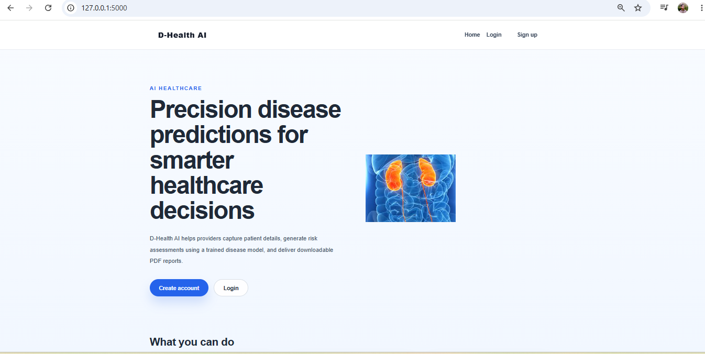
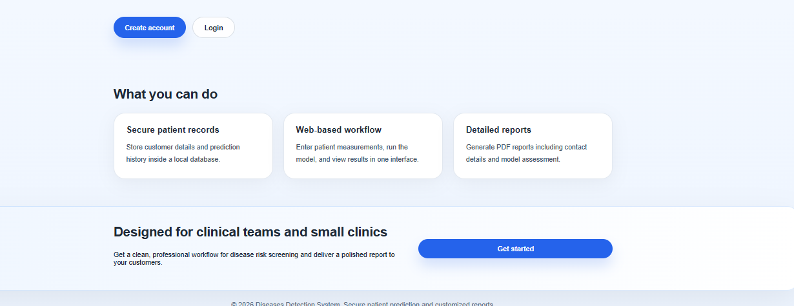
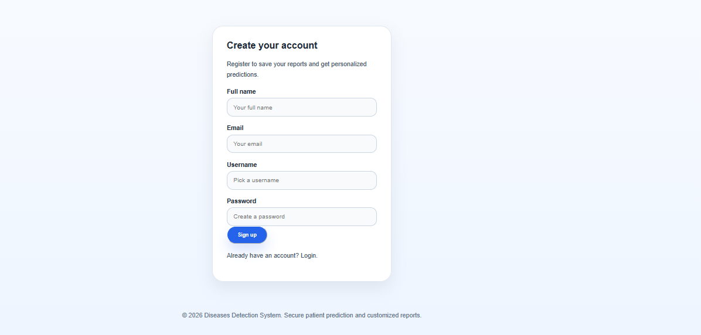

# Diseases Detection System

## Project Overview

The Diseases Detection System is a production-ready machine learning application built in Python and Flask. It combines structured data ingestion, preprocessing, model training, and a web interface to enable reliable disease prediction using clinical and laboratory indicators.

This repository demonstrates the full lifecycle of an end-to-end ML system:
- data ingestion and quality validation
- feature transformation and scaling
- model training, evaluation, and selection
- persistence of artifacts for inference
- interactive web application for patient report generation

## Key Features

- Robust data ingestion from cleaned medical datasets
- Preprocessing pipeline with feature scaling and transformation
- Multi-model evaluation to select the best performing model
- Model serialization for consistent inference behavior
- User authentication and report management via Flask
- Dynamic report generation and PDF-style output storage

## Project Architecture

The application follows a modular structure:

- `mlproject/src/components/` — data ingestion, transformation, and model training classes
- `mlproject/src/pipeline/` — orchestrates training and prediction workflows
- `mlproject/app.py` — Flask web server with authentication and reporting routes
- `mlproject/templates/` — UI templates for signup, login, dashboard, and report views
- `mlproject/static/` — CSS and static assets
- `mlproject/artifacts/` — generated model, preprocessor, train/test sets
- `mlproject/data/` — project data and local database storage

## Dataset

The repository leverages the cleaned kidney disease dataset located in:

- `mlproject/notebooks/datasets/kidney_disease_cleaned.csv`

Training and evaluation artifacts are saved under `mlproject/artifacts`.

## Installation

1. Create and activate a Python virtual environment:

```bash
cd "e:/100 days MachineLearning/Diseases detection system/mlproject"
python -m venv .venv
.venv/Scripts/activate
```

2. Install the required dependencies:

```bash
pip install -r requirements.txt
```

3. Verify the working directory is set to `mlproject` before running any pipeline or server commands.

## Usage

### Train the Model

Train the machine learning pipeline and generate artifacts:

```bash
cd "e:/100 days MachineLearning/Diseases detection system/mlproject"
python -c "from src.pipeline.train_pipeline import TrainPipeline; pipeline = TrainPipeline(); pipeline.run()"
```

### Run Predictions

Use the saved model and preprocessor to make predictions on test data:

```bash
cd "e:/100 days MachineLearning/Diseases detection system/mlproject"
python -c "from src.pipeline.predict_pipeline import PredictPipeline; import pandas as pd; predictor = PredictPipeline(); X = pd.read_csv('artifacts/test.csv').drop('classification', axis=1); predictions = predictor.predict(X); print(predictions)"
```

### Start the Web Application

Launch the Flask application and open the browser:

```bash
cd "e:/100 days MachineLearning/Diseases detection system/mlproject"
python app.py
```

Open `http://localhost:5000` in your browser to access the user interface.

## Application Screenshots

### Application Home Screen



### User Authentication and Dashboard



### Prediction Report Generation



### Additional Interface Preview


## Notes

- The Flask application uses `mlproject/img` for image assets and `mlproject/templates` for HTML views.
- Database and reporting files are created automatically under `mlproject/data` and `mlproject/reports`.
- Ensure Python dependencies are installed before running the training or the server.

## Contact

For issues, improvements, or deployment support, review the code modules under `mlproject/src` and the Flask routing logic in `mlproject/app.py`. Replace the development secret key in `app.py` before deploying to production.
